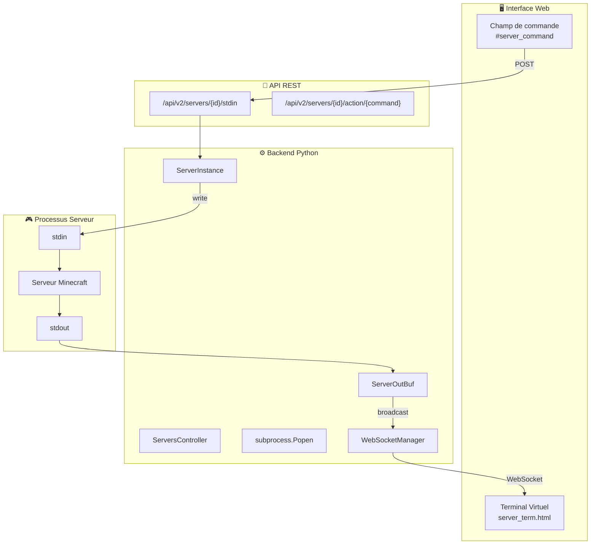
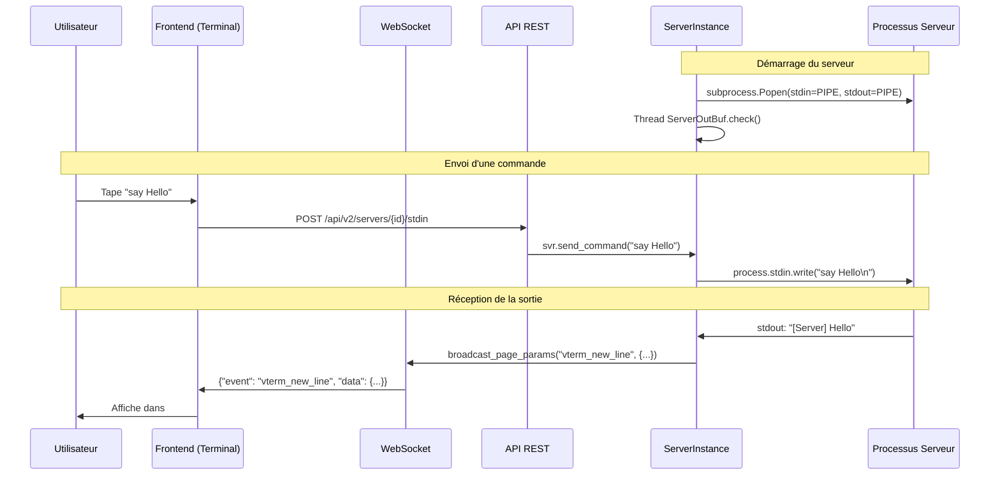

# Analyse du Processus Enfant pour Lancer des Serveurs dans Crafty-4

## Vue d'ensemble

Crafty-4 utilise un système de **processus enfant** via le module Python `subprocess` pour lancer et gérer les serveurs Minecraft, **sans utiliser `screen`**. L'accès à la console est fourni via une **interface web en temps réel** grâce aux WebSockets.

---

## Architecture Générale



---

## Fichiers Clés

| Fichier | Rôle |
|---------|------|
| [server.py](file:///Users/maxim/Downloads/crafty-4-master/app/classes/shared/server.py) | Classe `ServerInstance` - Gestion complète du cycle de vie serveur |
| [websocket_manager.py](file:///Users/maxim/Downloads/crafty-4-master/app/classes/shared/websocket_manager.py) | Singleton `WebSocketManager` - Diffusion des messages temps réel |
| [servers_controller.py](file:///Users/maxim/Downloads/crafty-4-master/app/classes/controllers/servers_controller.py) | `ServersController` - Orchestration des serveurs |
| [stdin.py](file:///Users/maxim/Downloads/crafty-4-master/app/classes/web/routes/api/servers/server/stdin.py) | Route API pour envoyer des commandes |
| [server_term.html](file:///Users/maxim/Downloads/crafty-4-master/app/frontend/templates/panel/server_term.html) | Interface du terminal virtuel |
| [websocket_handler.py](file:///Users/maxim/Downloads/crafty-4-master/app/classes/web/websocket_handler.py) | Handler Tornado pour WebSocket |

---

## Mécanisme Détaillé

### 1. Lancement du Serveur (`start_server`)

Le serveur est lancé avec `subprocess.Popen` dans la méthode `start_server()` de `ServerInstance`:

```python
# server.py - Lignes 592-598
self.process = subprocess.Popen(
    self.server_command,
    cwd=self.server_path,
    stdin=subprocess.PIPE,    # ← Permet d'écrire des commandes
    stdout=subprocess.PIPE,   # ← Permet de lire la sortie
    stderr=subprocess.STDOUT, # ← Redirige stderr vers stdout
)
```

**Points clés:**
- `stdin=subprocess.PIPE` : Permet d'envoyer des commandes au serveur
- `stdout=subprocess.PIPE` : Capture toute la sortie du serveur
- `stderr=subprocess.STDOUT` : Fusionne les erreurs avec la sortie standard
- `cwd=self.server_path` : Exécute le serveur dans son répertoire

---

### 2. Lecture de la Sortie (`ServerOutBuf`)

Une classe dédiée `ServerOutBuf` lit la sortie du processus **caractère par caractère** dans un thread séparé:

```python
# server.py - Lignes 123-184
class ServerOutBuf:
    lines = {}  # Buffer statique pour toutes les instances

    def __init__(self, helper, proc, server_id):
        self.proc = proc
        self.server_id = str(server_id)
        self.max_lines = self.helper.get_setting("virtual_terminal_lines")
        self.line_buffer = ""
        ServerOutBuf.lines[self.server_id] = []

    def check(self):
        """Lit la sortie caractère par caractère"""
        text_wrapper = io.TextIOWrapper(
            self.proc.stdout, encoding="UTF-8", errors="ignore", newline=""
        )
        while True:
            if self.proc.poll() is None:  # Processus en cours
                char = text_wrapper.read(1)
                self.process_byte(char)
            else:  # Processus terminé
                flush = text_wrapper.read()
                for char in flush:
                    self.process_byte(char)
                break

    def new_line_handler(self, new_line):
        """Diffuse chaque nouvelle ligne via WebSocket"""
        # Nettoie les codes ANSI
        new_line = re.sub("(\033\\[(0;)?[0-9]*[A-z]?(;[0-9])?m?)", " ", new_line)
        highlighted = self.helper.log_colors(html.escape(new_line))
        
        # Diffuse aux clients sur la page du serveur
        WebSocketManager().broadcast_page_params(
            "/panel/server_detail",
            {"id": self.server_id},
            "vterm_new_line",
            {"line": highlighted + "<br />"},
        )
```

Le thread est lancé juste après le démarrage du processus:

```python
# server.py - Lignes 631-636
out_buf = ServerOutBuf(self.helper, self.process, self.server_id)
threading.Thread(
    target=out_buf.check, 
    daemon=True, 
    name=f"{self.server_id}_virtual_terminal"
).start()
```

---

### 3. Envoi de Commandes (`send_command`)

Les commandes sont envoyées au serveur en écrivant directement dans `stdin`:

```python
# server.py - Lignes 1040-1050
@callback
def send_command(self, command):
    if not self.check_running() and command.lower() != "start":
        logger.warning(f'Server not running, unable to send command "{command}"')
        return False
    
    # Écrit la commande dans stdin du processus
    self.process.stdin.write(f"{command}\n".encode("utf-8"))
    self.process.stdin.flush()
    return True
```

---

### 4. Interface Web - Terminal Virtuel

Le frontend utilise WebSocket pour recevoir les logs en temps réel:

```javascript
// server_term.html - Lignes 241-246
$(document).ready(function () {
    get_server_log()  // Charge l'historique initial
    webSocket.on('vterm_new_line', new_line_handler)  // Écoute les nouvelles lignes
});

function new_line_handler(data) {
    $('#virt_console').append(data.line)
    // Auto-scroll si non désactivé
    if (!scrolled) {
        scrollConsole();
    }
}
```

Pour envoyer une commande:

```javascript
// server_term.html - Lignes 278-303
async function sendConsoleCommand() {
    let serverCommand = $("#server_command").val()
    
    let res = await fetch(`/api/v2/servers/${serverId}/stdin`, {
        method: 'POST',
        headers: {
            'X-XSRFToken': token
        },
        body: serverCommand,  // Commande envoyée dans le body
    });
    
    $("#server_command").val('')  // Vide le champ
}
```

---

### 5. Route API `/api/v2/servers/{id}/stdin`

La route API reçoit la commande et l'envoie au serveur:

```python
# stdin.py - Lignes 66-85
decoded = self.request.body.decode("utf-8")

# Audit log
self.controller.management.add_to_audit_log(
    auth_data[4]["user_id"],
    f"Sent command ({decoded}) to terminal",
    server_id=server_id,
    source_ip=self.get_remote_ip(),
)

# Envoi au serveur
if svr.send_command(self.request.body.decode("utf-8")):
    return self.finish_json(200, {"status": "ok"})
```

---

## WebSocket Manager

Le `WebSocketManager` est un **Singleton** qui gère tous les clients WebSocket connectés:

```python
# websocket_manager.py
class WebSocketManager(metaclass=Singleton):
    def __init__(self):
        self.clients = set()

    def broadcast_page_params(self, page: str, params: dict, event_type: str, data):
        """Diffuse uniquement aux clients sur une page spécifique avec des paramètres"""
        def filter_fn(client):
            if client.page != page:
                return False
            for key, param in params.items():
                if param != client.page_query_params.get(key, None):
                    return False
            return True
        
        self.broadcast_with_fn(filter_fn, event_type, data)
```

Cela permet de n'envoyer les logs d'un serveur **qu'aux utilisateurs visualisant ce serveur spécifique**.

---

## Flux Complet



---

## Arrêt du Serveur

L'arrêt utilise la commande de stop configurée (par défaut `stop`):

```python
# server.py - Lignes 943-949
if self.settings["stop_command"]:
    self.send_command(self.settings["stop_command"])  # Envoie "stop"
    self.write_player_cache()
else:
    self.process.terminate()  # Fallback: signal SIGTERM
```

Un timeout configurable (`shutdown_timeout`) attend la fermeture propre, puis force (`kill`) si nécessaire.

---

## Avantages de cette Architecture

| Avantage | Description |
|----------|-------------|
| **Pas de dépendance externe** | Pas besoin de `screen`, `tmux` ou autre multiplexeur |
| **Temps réel** | WebSocket fournit les logs instantanément |
| **Multi-utilisateurs** | Plusieurs utilisateurs peuvent voir la même console |
| **Permissions** | Système de permissions intégré pour l'accès console |
| **Audit** | Toutes les commandes sont loguées |
| **Portable** | Fonctionne sur Windows et Unix |

---

## Résumé des Classes Principales

### `ServerInstance` (server.py)
- Gère le cycle de vie complet d'un serveur
- Attributs: `process`, `server_id`, `name`, `settings`
- Méthodes clés: `start_server()`, `stop_server()`, `send_command()`, `check_running()`

### `ServerOutBuf` (server.py)
- Buffer de sortie pour le terminal virtuel
- Lit stdout caractère par caractère
- Diffuse les lignes complètes via WebSocket

### `ServersController` (servers_controller.py)
- Singleton orchestrant tous les serveurs
- Maintient `servers_list` avec tous les `ServerInstance`
- Fournit `get_server_instance_by_id()`

### `WebSocketManager` (websocket_manager.py)
- Singleton gérant les connexions WebSocket
- Méthodes de broadcast ciblées (page, utilisateur, paramètres)
