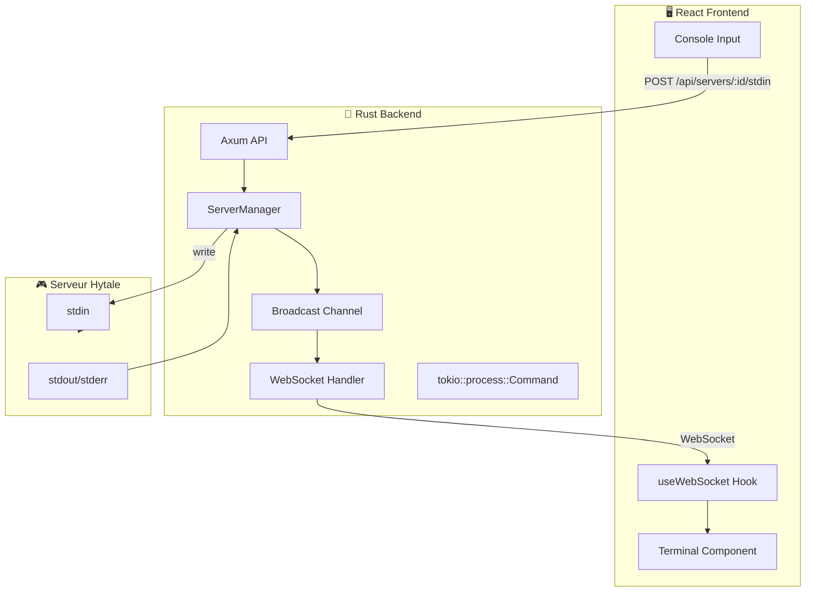

# Guide d'Implémentation - Gestion de Processus Serveur avec React + Rust

## Architecture Proposée



---

## Backend Rust

### 1. Dépendances Cargo.toml

```toml
[dependencies]
tokio = { version = "1", features = ["full", "process"] }
axum = { version = "0.7", features = ["ws"] }
tokio-tungstenite = "0.21"
serde = { version = "1", features = ["derive"] }
serde_json = "1"
uuid = { version = "1", features = ["v4"] }
dashmap = "5"  # HashMap thread-safe
tracing = "0.1"
```

---

### 2. Structure ServerInstance

```rust
use std::sync::Arc;
use tokio::process::{Child, Command};
use tokio::io::{AsyncBufReadExt, AsyncWriteExt, BufReader};
use tokio::sync::broadcast;
use uuid::Uuid;

pub struct ServerInstance {
    pub id: Uuid,
    pub name: String,
    process: Option<Child>,
    stdin_tx: Option<tokio::sync::mpsc::Sender<String>>,
    // Channel pour diffuser les logs à tous les clients
    pub log_tx: broadcast::Sender<String>,
}

impl ServerInstance {
    pub fn new(id: Uuid, name: String) -> Self {
        let (log_tx, _) = broadcast::channel(1000); // Buffer de 1000 messages
        Self {
            id,
            name,
            process: None,
            stdin_tx: None,
            log_tx,
        }
    }
}
```

---

### 3. Lancement du Processus

```rust
impl ServerInstance {
    pub async fn start(&mut self, command: &str, working_dir: &Path) -> Result<(), Error> {
        // Parse la commande
        let parts: Vec<&str> = command.split_whitespace().collect();
        let (program, args) = parts.split_first().unwrap();
        
        // Lance le processus avec stdin/stdout capturés
        let mut child = Command::new(program)
            .args(args)
            .current_dir(working_dir)
            .stdin(Stdio::piped())    // ← Capture stdin
            .stdout(Stdio::piped())   // ← Capture stdout
            .stderr(Stdio::piped())   // ← Capture stderr
            .kill_on_drop(true)       // ← Kill auto si drop
            .spawn()?;
        
        // Récupère stdin pour écrire des commandes
        let stdin = child.stdin.take().unwrap();
        let stdout = child.stdout.take().unwrap();
        let stderr = child.stderr.take().unwrap();
        
        // Channel pour envoyer des commandes au processus
        let (stdin_tx, mut stdin_rx) = tokio::sync::mpsc::channel::<String>(100);
        self.stdin_tx = Some(stdin_tx);
        
        // Task pour gérer l'écriture stdin
        let mut stdin = stdin;
        tokio::spawn(async move {
            while let Some(cmd) = stdin_rx.recv().await {
                if stdin.write_all(format!("{}\n", cmd).as_bytes()).await.is_err() {
                    break;
                }
                let _ = stdin.flush().await;
            }
        });
        
        // Task pour lire stdout
        let log_tx = self.log_tx.clone();
        let server_id = self.id;
        tokio::spawn(async move {
            let reader = BufReader::new(stdout);
            let mut lines = reader.lines();
            while let Ok(Some(line)) = lines.next_line().await {
                // Nettoie les codes ANSI si nécessaire
                let clean_line = strip_ansi_codes(&line);
                let _ = log_tx.send(clean_line);
            }
            tracing::info!("Server {} stdout reader finished", server_id);
        });
        
        // Task pour lire stderr (fusionné avec stdout)
        let log_tx = self.log_tx.clone();
        tokio::spawn(async move {
            let reader = BufReader::new(stderr);
            let mut lines = reader.lines();
            while let Ok(Some(line)) = lines.next_line().await {
                let clean_line = strip_ansi_codes(&line);
                let _ = log_tx.send(format!("[STDERR] {}", clean_line));
            }
        });
        
        self.process = Some(child);
        Ok(())
    }
}

fn strip_ansi_codes(s: &str) -> String {
    // Regex pour retirer les codes ANSI
    let re = regex::Regex::new(r"\x1b\[[0-9;]*m").unwrap();
    re.replace_all(s, "").to_string()
}
```

---

### 4. Envoi de Commandes

```rust
impl ServerInstance {
    pub async fn send_command(&self, command: &str) -> Result<(), Error> {
        if let Some(tx) = &self.stdin_tx {
            tx.send(command.to_string()).await
                .map_err(|_| Error::ServerNotRunning)?;
            Ok(())
        } else {
            Err(Error::ServerNotRunning)
        }
    }
    
    pub fn is_running(&self) -> bool {
        self.process.as_ref()
            .map(|p| p.id().is_some())
            .unwrap_or(false)
    }
    
    pub async fn stop(&mut self) -> Result<(), Error> {
        // Envoie la commande stop
        self.send_command("stop").await?;
        
        // Attend la fermeture avec timeout
        if let Some(ref mut process) = self.process {
            match tokio::time::timeout(
                std::time::Duration::from_secs(30),
                process.wait()
            ).await {
                Ok(_) => {},
                Err(_) => {
                    // Timeout: force kill
                    process.kill().await?;
                }
            }
        }
        
        self.process = None;
        self.stdin_tx = None;
        Ok(())
    }
}
```

---

### 5. ServerManager (Singleton/State)

```rust
use dashmap::DashMap;
use std::sync::Arc;

pub struct ServerManager {
    servers: DashMap<Uuid, Arc<tokio::sync::RwLock<ServerInstance>>>,
}

impl ServerManager {
    pub fn new() -> Self {
        Self {
            servers: DashMap::new(),
        }
    }
    
    pub fn get_server(&self, id: &Uuid) -> Option<Arc<tokio::sync::RwLock<ServerInstance>>> {
        self.servers.get(id).map(|s| s.clone())
    }
    
    pub async fn start_server(&self, id: &Uuid, command: &str, path: &Path) -> Result<(), Error> {
        if let Some(server) = self.get_server(id) {
            let mut server = server.write().await;
            server.start(command, path).await
        } else {
            Err(Error::ServerNotFound)
        }
    }
}
```

---

### 6. Route API stdin

```rust
use axum::{
    extract::{Path, State},
    response::Json,
    routing::post,
    Router,
};

async fn send_stdin(
    State(manager): State<Arc<ServerManager>>,
    Path(server_id): Path<Uuid>,
    body: String,
) -> Result<Json<ApiResponse>, ApiError> {
    let server = manager.get_server(&server_id)
        .ok_or(ApiError::NotFound)?;
    
    let server = server.read().await;
    server.send_command(&body).await?;
    
    Ok(Json(ApiResponse::ok()))
}

pub fn router(manager: Arc<ServerManager>) -> Router {
    Router::new()
        .route("/api/servers/:id/stdin", post(send_stdin))
        .with_state(manager)
}
```

---

### 7. WebSocket Handler

```rust
use axum::{
    extract::{ws::{Message, WebSocket, WebSocketUpgrade}, Path, State},
    response::Response,
};
use futures::{SinkExt, StreamExt};

async fn ws_handler(
    ws: WebSocketUpgrade,
    State(manager): State<Arc<ServerManager>>,
    Path(server_id): Path<Uuid>,
) -> Response {
    ws.on_upgrade(move |socket| handle_socket(socket, manager, server_id))
}

async fn handle_socket(socket: WebSocket, manager: Arc<ServerManager>, server_id: Uuid) {
    let (mut sender, mut receiver) = socket.split();
    
    // Récupère le channel de logs du serveur
    let server = match manager.get_server(&server_id) {
        Some(s) => s,
        None => return,
    };
    
    let server = server.read().await;
    let mut log_rx = server.log_tx.subscribe();
    drop(server); // Libère le lock
    
    // Task pour envoyer les logs au client
    let send_task = tokio::spawn(async move {
        while let Ok(line) = log_rx.recv().await {
            let msg = serde_json::json!({
                "event": "log_line",
                "data": { "line": line }
            });
            
            if sender.send(Message::Text(msg.to_string())).await.is_err() {
                break;
            }
        }
    });
    
    // Task pour recevoir les messages du client (optionnel)
    let recv_task = tokio::spawn(async move {
        while let Some(Ok(msg)) = receiver.next().await {
            // Traite les messages entrants si nécessaire
            match msg {
                Message::Close(_) => break,
                _ => {}
            }
        }
    });
    
    // Attend que l'une des tasks se termine
    tokio::select! {
        _ = send_task => {},
        _ = recv_task => {},
    }
}
```

---

## Frontend React

### 1. Hook useServerWebSocket

```typescript
// hooks/useServerWebSocket.ts
import { useEffect, useRef, useState, useCallback } from 'react';

interface LogLine {
  line: string;
  timestamp: Date;
}

export function useServerWebSocket(serverId: string) {
  const [logs, setLogs] = useState<LogLine[]>([]);
  const [isConnected, setIsConnected] = useState(false);
  const wsRef = useRef<WebSocket | null>(null);
  
  useEffect(() => {
    const ws = new WebSocket(`ws://localhost:8080/api/servers/${serverId}/ws`);
    wsRef.current = ws;
    
    ws.onopen = () => {
      setIsConnected(true);
      console.log('WebSocket connected');
    };
    
    ws.onmessage = (event) => {
      const data = JSON.parse(event.data);
      if (data.event === 'log_line') {
        setLogs(prev => [...prev.slice(-499), {  // Garde les 500 dernières lignes
          line: data.data.line,
          timestamp: new Date()
        }]);
      }
    };
    
    ws.onclose = () => {
      setIsConnected(false);
      console.log('WebSocket disconnected');
    };
    
    ws.onerror = (error) => {
      console.error('WebSocket error:', error);
    };
    
    return () => {
      ws.close();
    };
  }, [serverId]);
  
  const clearLogs = useCallback(() => setLogs([]), []);
  
  return { logs, isConnected, clearLogs };
}
```

---

### 2. Hook useServerCommands

```typescript
// hooks/useServerCommands.ts
import { useCallback } from 'react';

export function useServerCommands(serverId: string) {
  const sendCommand = useCallback(async (command: string) => {
    const response = await fetch(`/api/servers/${serverId}/stdin`, {
      method: 'POST',
      headers: { 'Content-Type': 'text/plain' },
      body: command,
    });
    
    if (!response.ok) {
      throw new Error('Failed to send command');
    }
    
    return response.json();
  }, [serverId]);
  
  const startServer = useCallback(() => 
    fetch(`/api/servers/${serverId}/start`, { method: 'POST' }),
  [serverId]);
  
  const stopServer = useCallback(() => 
    fetch(`/api/servers/${serverId}/stop`, { method: 'POST' }),
  [serverId]);
  
  return { sendCommand, startServer, stopServer };
}
```

---

### 3. Composant Terminal

```tsx
// components/ServerTerminal.tsx
import { useState, useRef, useEffect, KeyboardEvent } from 'react';
import { useServerWebSocket } from '../hooks/useServerWebSocket';
import { useServerCommands } from '../hooks/useServerCommands';

interface Props {
  serverId: string;
}

export function ServerTerminal({ serverId }: Props) {
  const { logs, isConnected } = useServerWebSocket(serverId);
  const { sendCommand } = useServerCommands(serverId);
  const [input, setInput] = useState('');
  const [history, setHistory] = useState<string[]>([]);
  const [historyIndex, setHistoryIndex] = useState(-1);
  const terminalRef = useRef<HTMLDivElement>(null);
  
  // Auto-scroll
  useEffect(() => {
    if (terminalRef.current) {
      terminalRef.current.scrollTop = terminalRef.current.scrollHeight;
    }
  }, [logs]);
  
  const handleKeyDown = async (e: KeyboardEvent<HTMLInputElement>) => {
    if (e.key === 'Enter' && input.trim()) {
      await sendCommand(input);
      setHistory(prev => [...prev, input]);
      setHistoryIndex(-1);
      setInput('');
    } else if (e.key === 'ArrowUp') {
      e.preventDefault();
      if (historyIndex < history.length - 1) {
        const newIndex = historyIndex + 1;
        setHistoryIndex(newIndex);
        setInput(history[history.length - 1 - newIndex]);
      }
    } else if (e.key === 'ArrowDown') {
      e.preventDefault();
      if (historyIndex > 0) {
        const newIndex = historyIndex - 1;
        setHistoryIndex(newIndex);
        setInput(history[history.length - 1 - newIndex]);
      } else {
        setHistoryIndex(-1);
        setInput('');
      }
    }
  };
  
  return (
    <div className="terminal-container">
      <div className="terminal-header">
        <span className={`status ${isConnected ? 'online' : 'offline'}`}>
          {isConnected ? '● Connecté' : '○ Déconnecté'}
        </span>
      </div>
      
      <div ref={terminalRef} className="terminal-output">
        {logs.map((log, i) => (
          <div key={i} className="log-line">
            {log.line}
          </div>
        ))}
      </div>
      
      <div className="terminal-input">
        <span className="prompt">&gt;</span>
        <input
          type="text"
          value={input}
          onChange={(e) => setInput(e.target.value)}
          onKeyDown={handleKeyDown}
          placeholder="Entrez une commande..."
          autoFocus
        />
      </div>
    </div>
  );
}
```

---

### 4. CSS Terminal

```css
/* styles/terminal.css */
.terminal-container {
  display: flex;
  flex-direction: column;
  height: 500px;
  background: #1e1e1e;
  border-radius: 8px;
  font-family: 'JetBrains Mono', 'Fira Code', monospace;
  font-size: 13px;
}

.terminal-header {
  padding: 8px 12px;
  background: #2d2d2d;
  border-radius: 8px 8px 0 0;
}

.status.online { color: #4caf50; }
.status.offline { color: #f44336; }

.terminal-output {
  flex: 1;
  overflow-y: auto;
  padding: 12px;
  color: #d4d4d4;
}

.log-line {
  white-space: pre-wrap;
  word-break: break-all;
  line-height: 1.4;
}

.terminal-input {
  display: flex;
  align-items: center;
  padding: 8px 12px;
  background: #252525;
  border-radius: 0 0 8px 8px;
}

.terminal-input .prompt {
  color: #4caf50;
  margin-right: 8px;
}

.terminal-input input {
  flex: 1;
  background: transparent;
  border: none;
  color: #d4d4d4;
  font-family: inherit;
  font-size: inherit;
  outline: none;
}
```

---

## Résumé des Différences Crafty vs React/Rust

| Aspect | Crafty (Python) | Ton projet (Rust) |
|--------|-----------------|-------------------|
| Processus | `subprocess.Popen` | `tokio::process::Command` |
| Lecture sortie | Caractère par caractère (sync thread) | `BufReader::lines()` (async) |
| Communication | `Helpers.broadcast()` via Singleton | `broadcast::channel` Tokio |
| WebSocket | Tornado WebSocketHandler | Axum WS + tungstenite |
| Frontend | jQuery + templates Tornado | React + hooks TypeScript |
| Concurrence | Threading Python | async/await Tokio |

---

## Points Clés à Implémenter

1. **Buffer de logs** - Stocke les N dernières lignes pour les nouveaux clients
2. **Reconnexion WebSocket** - Gérer les déconnexions côté frontend
3. **Authentification** - Vérifier les permissions avant d'accepter les connexions WS
4. **Timeout graceful stop** - Attendre puis forcer le kill
5. **Historique commandes** - Stocker en localStorage côté frontend
